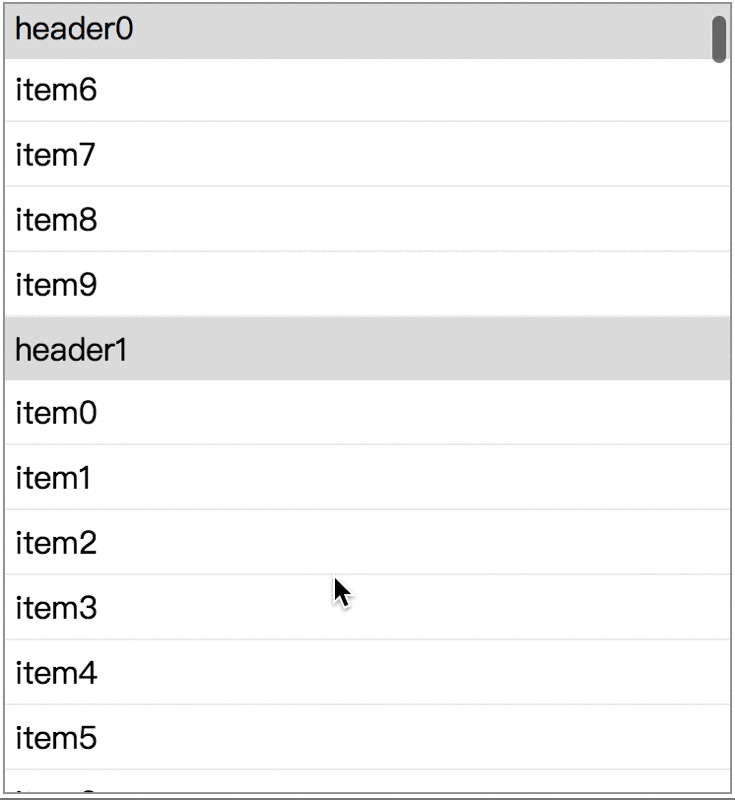

[](https://www.npmjs.com/package/stickylist)
[](https://www.npmjs.com/package/stickylist)
[](https://npmjs.org/package/stickylist)

# StickyList
React sticky header listview component

<p align="center">
  <a href="https://gwuhaolin.github.io/redemo/">
    
  </a>
</p>

- easy to use
- high performance
- scalable and custom styles

## Use
1. Install by `npm i stickylist`
2. Provide data, StickyList will render it:
```js
import StickyList from 'stickylist';

const DATA = [
  {
    header: 'ListA',
    key: 'A',
    items: [
      { key:1, display: 'item1'},
      { key:2, display: 'item2'},
    ]
  }
]

<StickyList data={DATA}/>
```

Notice that `key` in data is for improve performance, if not provide will use index as key.

See a [live demo](https://gwuhaolin.github.io/stickylist/) and it's [source code](https://github.com/gwuhaolin/stickylist/blob/master/src/doc/index.js).

### Custom styles
StickyList's HTML struts in className:
```
.sl-wrap
   .sl-group
       .sl-header
       .sl-items
           .sl-item
           .sl-item
           ...
   .sl-group
       .sl-header
       .sl-items
           .sl-item
           .sl-item
           ...
   ...
```
You can add style to these className to custom styles.
